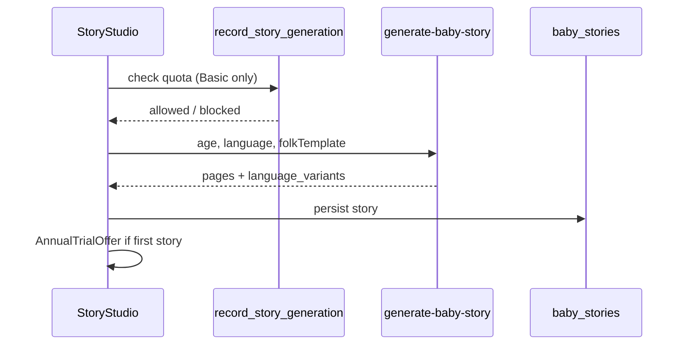

# AI Baby Book — Feature Plan

> Nestbean Plus: emotional payoff (stories, flip-book, voice, HD photos). Basic: recording habit free forever.

**Status:** Shipped (v2 UI + pipeline stubs)  
**Last updated:** July 2026

---

## Product principle

**Free = the recording habit.** Milestone tracking, captions, and community browse stay free.  
**Paid = the magic rendering.** Gate AI stories (after 1 free), flip-book themes, voice clone, HD uploads, export, print, and viewer seats.

Editorial/travel/shopping/assistant perks remain bundled in **Plus** (layered model).

---

## Twilight sub-brand

The baby book is a **nested twilight product** inside the ivory Nestbean app — intentional contrast for paid “magic rendering.”

| Element | Spec |
|---------|------|
| Route | `/baby/book/:tab` — tabs: `home`, `stories`, `ideas`, `book`, `family` |
| Prototype | [`docs/prototypes/baby-book.html`](prototypes/baby-book.html) (self-contained stakeholder demo) |
| Styles | [`src/styles/baby-book.css`](../src/styles/baby-book.css) — scoped under `.baby-book-shell` |
| Display type | **Newsreader** italic |
| Body type | **Manrope** |
| Background | Twilight gradient + canvas starfield |
| Cards | Glass (`backdrop-filter`), gold rim glow |

Entry CTA: **My Baby** → “Open baby book” band → `/baby/book/home`.

---

## Tiers

| | Basic (free) | Plus |
|---|--------------|------|
| Milestone tracking + captions | Unlimited | Unlimited |
| Monthly album photos | 2/month, 2D | Unlimited HD |
| AI stories | 1 ever (full quality) | Unlimited, 12 languages, folk-tale mode |
| Voice clone narration | — | Parent + grandparent invite |
| Voice notes | 3 × 30s | Unlimited |
| Flip-book | 2D preview + watermark | Full 3D parallax (+ pop-up/snow-globe stubs) |
| AI photo-book ideas | Preview cards | One-tap generate |
| 4K export | — | Yes |
| Print | Full price | 20% off + free shipping + sealed capsule page |
| Viewer seats | — | 2 |
| Editorial perks | Teaser | Full |

---

## Universal native-language storytelling

Three layers (Stories tab):

1. **Language** — 12 locales in [`src/constants/storyLanguages.js`](../src/constants/storyLanguages.js). Live switch demo via `language_variants` jsonb — culturally adapted, not translated.
2. **Voice** — 60s sample → ElevenLabs clone (Edge Function `clone-voice-profile`). Grandparent invite at `/book/voice-invite/:token` with owner approval gate.
3. **Folk-tale** — Original templates in [`src/data/folkTaleTemplates.js`](../src/data/folkTaleTemplates.js). UI copy: *“Inspired by folk traditions worldwide — an original Nestbean story.”*

### Stories tab layout (Story Studio)

Full studio lives at `/baby/book/stories` inside the twilight shell — **not** on My Baby (ivory surfaces). My Baby shows a sand-band teaser linking to the Stories tab.

Vertical workflow (`.baby-book-studio` in [`baby-book.css`](../src/styles/baby-book.css)):

| Section | Component |
|---------|-----------|
| Monthly chapter | `story/StoryChapterBanner.jsx` — [`getMonthlyChapterReminder`](../src/utils/bookReminders.js) |
| Quota | `story/StoryQuotaChip.jsx` — Basic free story vs Plus unlimited |
| How it works | `story/StoryHowItWorks.jsx` — 3-step cards |
| Source photos | `story/StorySourcePhotos.jsx` — [`useMonthlyAlbum`](../src/hooks/useMonthlyAlbum.js) strip |
| Scene picker | `story/StoryScenePicker.jsx` — [`storyScenes.js`](../src/data/storyScenes.js) (Astronaut / Artist / Explorer / Musician) |
| Folk-tale mode | `FolkTaleToggle.jsx` — template pills + beat timeline |
| Language preview | `LanguageSwitchDemo.jsx` — title, page labels, 12-language pills |
| Persona & art (Plus) | `story/StoryPersonaPicker.jsx` — narrator + art style |
| Generate CTA | `StoryStudio.jsx` — quota-gated via [`useEntitlements`](../src/hooks/useEntitlements.js) |
| Preview | `story/StoryPreviewPanel.jsx` + `story/StoryPreviewActions.jsx` — paginated pages, Open in 3D Book |
| History | `story/StoryHistoryList.jsx` — [`useBabyStories`](../src/hooks/useBabyStories.js) |
| Voice + invite | `story/StoryVoiceMode.jsx`, `VoiceCloneRecorder.jsx`, `GrandparentInviteFlow.jsx` (Plus) |

Demo content: [`storyGeneration.js`](../src/utils/storyGeneration.js) + [`storyScenes.js`](../src/data/storyScenes.js) — scene lines, month-aware pages, persona/art closing, `getFolkBeatLabels()`.

Read aloud: `speechSynthesis` (Storyteller) or [`narrate-story-page`](../supabase/functions/narrate-story-page/index.ts) via [`narrateStory.js`](../src/utils/narrateStory.js) when clone exists.

### Home tab (Memory Lane)

| Block | Component |
|-------|-----------|
| Hero + stats | `home/BookHomeHero.jsx` — name, month age, memory count |
| Reminder | existing banner → Stories tab |
| 3D album CTA | `home/BookAlbumHero.jsx` |
| Month list | `home/BookMonthList.jsx` — [`bookChapters.js`](../src/data/bookChapters.js) |
| Carousel | “New in Nestbean” feature cards |

Personalization: [`babyName`](../src/utils/babyName.js) localStorage key + auth profile fallback.

Prototype reference: [`docs/prototypes/nestmile-v2.html`](prototypes/nestmile-v2.html)

Entry points: baby book Stories tab · My Baby teaser · [`GuideStoryCta.jsx`](../src/components/book/GuideStoryCta.jsx) → `ROUTES.babyBookTab('stories')`.

---

## AI photo-book ideas (Ideas tab)

10 concepts — detection in [`src/utils/bookIdeaDetection.js`](../src/utils/bookIdeaDetection.js):

`sameSpotSeries` · `littleHandsFeet` · `thenAndNow` · `sleepGallery` · `firstTastes` · `letterAt18` · `familyConstellation` · `festivalFirsts` · `growthChart` · `alphabetOfYou`

Edge Function: `generate-book-idea` (layout job stub).

---

## 3D book (Book tab)

[`BookSpreadViewer.jsx`](../src/components/book/BookSpreadViewer.jsx) — open-book spread with CSS page-turn; left page photo/parallax, right page chapter copy from [`bookChapters.js`](../src/data/bookChapters.js).

| Style | Status |
|-------|--------|
| **Parallax** | Shipped — Three.js in left page via [`ParallaxPage.jsx`](../src/components/book/ParallaxPage.jsx) |
| Pop-up | CSS depth mock on spread |
| Snow-globe | CSS orb spin mock on spread |

Depth segmentation: Edge Function `segment-photo-depth` (Replicate when `REPLICATE_API_TOKEN` set). Cache: `book_page_layers` table.

---

## Family tab

- **Time Capsule** — sealed until 18th birthday; print upsell includes sealed page
- **Grandparent gift** — $59.99 SKU → Premium page
- **Voice blessings** — `voice_blessings` feed
- **Sibling profiles** — `baby_profiles` table (second child = separate subscription check — future)

Smart reminder: [`src/utils/bookReminders.js`](../src/utils/bookReminders.js) on Home tab.

---

## Story pipeline

**Edge Functions:** `generate-baby-story`, `clone-voice-profile`, `narrate-story-page`, `generate-book-idea`, `segment-photo-depth`, `cleanup-photo`

---

## Database (v2)

Migration: [`supabase/migrations/20250703120000_baby_book_v2.sql`](../supabase/migrations/20250703120000_baby_book_v2.sql)

| Table | Purpose |
|-------|---------|
| `baby_stories` + language columns | Multilingual stories |
| `voice_profiles` | Parent/grandparent voice clones |
| `voice_blessings` | Family Circle audio |
| `time_capsules` | Sealed letters |
| `baby_profiles` | Sibling support |
| `book_ideas` | AI concept jobs |
| `book_page_layers` | Depth segmentation cache |

Base tables: [`20250702120000_plus_entitlements.sql`](../supabase/migrations/20250702120000_plus_entitlements.sql)

---

## Trial rule

- **No trial on signup.** New users start as Basic.
- After **first AI story**: offer **7-day Plus trial on annual plan only**.
- Monthly plan: no free trial.

---

## Acceptance criteria (v2)

- [x] `/baby/book` twilight shell with 5 tabs
- [x] Stories: EN → हिन्दी → Español live switch (demo + Edge Function)
- [x] Folk-tale toggle with original templates
- [x] Voice recorder + grandparent invite + approval flow
- [x] Ideas: 10 cards with photo counts from album + first moments
- [x] 3D Book: parallax renderer + style selector
- [x] Family: time capsule + gift/print tiers + blessings feed
- [x] Home: monthly chapter reminder + feature carousel
- [x] Home: Memory Lane hero, 3D album CTA, month chapter list
- [x] Stories: scene picker + storyteller/voice toggle + read-aloud
- [x] 3D Book: open spread + page-turn animation
- [x] Ideas/Family v2 card polish
- [x] Stripe checkout creates `memberships.plan=plus` (webhook + unit test)
- [ ] Production ElevenLabs + Replicate API keys wired in deployed env

---

## Code map

| Area | Files |
|------|-------|
| Shell | `src/pages/BabyBook.jsx`, `src/components/book/BabyBookShell.jsx` |
| Home | `BookHomeTab.jsx`, `home/BookHomeHero.jsx`, `home/BookAlbumHero.jsx`, `home/BookMonthList.jsx` |
| Stories | `StoryStudio.jsx`, `story/*`, `LanguageSwitchDemo.jsx`, `FolkTaleToggle.jsx`, `AnnualTrialOffer.jsx` |
| 3D | `FlipBookViewer.jsx`, `BookSpreadViewer.jsx`, `ParallaxPage.jsx`, `RenderStyleSelector.jsx` |
| Family | `FamilyCircleTab.jsx`, `FamilyCirclePanel.jsx`, `PrintTierCards.jsx`, `VoiceBlessingsFeed.jsx` |
| Hooks | `useBabyStories.js`, `useVoiceProfiles.js`, `useBookIdeas.js`, `useBabyProfiles.js`, `useMonthlyAlbum.js` |
| Data | `storyLanguages.js`, `storyScenes.js`, `bookChapters.js`, `folkTaleTemplates.js`, `festivalCalendar.js` |
| Tiers | `src/constants/premium.js`, `src/utils/entitlements.js` |
