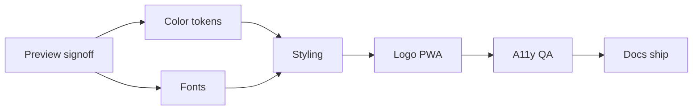

# Yarn Trails Visual System — Retheme Plan

> Full **color + type + styling + theming** evolution so the product looks like Yarn Trails (wool, thread, trail), not Nestbean terracotta-cream.  
> Companion to [`yarntrails-rebrand-plan.md`](yarntrails-rebrand-plan.md).  
> **Interactive preview:** [`docs/prototypes/yarntrails-visual-system.html`](prototypes/yarntrails-visual-system.html) (open in a browser).

**Status:** Implemented in code (July 2026)  
**Prerequisite:** Name/logo geometry rebrand shipped  
**Source of truth after ship:** [`src/styles/global.css`](../src/styles/global.css) · this plan · [`design-system-2026.md`](design-system-2026.md)

---

## Design thesis

| | Nestbean (today) | Yarn Trails (target) |
|--|------------------|----------------------|
| Metaphor | Nest + bean | Yarn (craft) + trail (journey) |
| Color mood | Warm terracotta on ivory | Cool wool mist + moss trail + spun gold |
| Display type | Fraunces (soft editorial serif) | **Newsreader** — literary journal / storybook |
| Body type | Switzer | **Manrope** — clear, calm UI (already loaded for baby book) |
| Surfaces | Warm cream cards | Mist panels, flax soft accents, moss CTAs |
| Chrome | Coral-forward | Trail-forward; gold as yarn accent only |

**Quiet luxury stays** (generous space, restrained motion, PageHero). **Palette + typeface + surface styling change.**

---

## 1. Color — Wool & Trail

| Role | Token | Hex | Use |
|------|-------|-----|-----|
| Trail primary | `--coral-primary` / `--brand-trail` | `#3F5E52` | CTAs, active nav, focus |
| Trail hover | `--coral-primary-dark` | `#2F4A40` | Hover / pressed |
| Trail tint | `--coral-primary-light` | `#D5E3DC` | Chips, soft fills, hero wash |
| Yarn gold | `--brand-gold` | `#C4A35A` | Logo yarn, premium spark, hairline rules |
| Yarn deep | `--gold-dark` | `#9A7D3A` | Gold hover / strokes |
| Wool mist | `--cream` | `#F3F5F2` | Page background |
| Wool fill | `--cream-dark` | `#E4E9E4` | Inputs, inset panels |
| Trail sand | `--sand` | `#EBEFEC` | Muted strips |
| Flax | `--brand-clay` | `#D2C0A4` | Soft warm accent (not terracotta) |
| Ink | `--text-primary` | `#1E2A26` | Headings / body |
| Meta | `--text-secondary` | `#4A5650` | Secondary copy |

```
BEFORE                          AFTER
████ #C2603E terracotta         ████ #3F5E52 trail moss
████ #C9A24B gold               ████ #C4A35A yarn gold
████ #FCF8F2 warm cream         ████ #F3F5F2 wool mist
████ #2B2622 warm ink           ████ #1E2A26 forest ink
```

**Secondary pastels** (lavender / mint / rose / baby-blue): keep for activity categories but desaturate ~10–15% so they sit on mist without fighting moss.

**Avoid:** purple-indigo gradients; terracotta-on-cream return; gold as body text color.

---

## 2. Typography

### Locked pair

| Role | Font | Load | Why |
|------|------|------|-----|
| Display | **Newsreader** | Already in `index.html` (baby book) | Soft literary serif — stories, trails, journals; less “luxury spa Fraunces” cliché |
| Body / UI | **Manrope** | Already in `index.html` | Geometric humanist; excellent small-size UI; pairs with Newsreader |
| Mono | Geist Mono (keep) | existing | Code / admin tables |

### CSS tokens (target)

```css
--font-display: 'Newsreader', Georgia, 'Times New Roman', serif;
--font-body: 'Manrope', system-ui, sans-serif;
```

Remove (or stop importing) Fraunces + Switzer from [`global.css`](../src/styles/global.css) once Manrope/Newsreader cover all consumer UI. Keep one Fontshare or Google bundle to avoid duplicate loads.

### Type rhythm tweaks

| Token | Today (approx) | Target tweak |
|-------|----------------|--------------|
| Hero display | Fraunces ~40–48, tight | Newsreader 600, `letter-spacing: -0.02em`, slightly looser line-height `1.15` |
| Section titles | Fraunces | Newsreader 500–600 |
| Body | Switzer 16 / 1.6 | Manrope 16 / 1.65 (tired-eye comfort) |
| Labels / nav | Switzer 500 | Manrope 500–600, tracking `0.02em` on nav only |
| Wordmark | Fraunces in logo lockup | Newsreader or keep SVG text as drawn; in-app lockup uses `--font-display` |

### Rules (unchanged)

- Body ≥ 16px mobile  
- Max ~65–75ch line length  
- No all-caps blocks > 2 words  
- WCAG AA contrast on mist  

---

## 3. Styling & component theming

### Global surfaces

| Element | Before | After |
|---------|--------|-------|
| Page | Warm ivory flat | Wool mist; optional subtle top gradient `mist → sand` (very soft) |
| Cards / panels | Cream / white + warm shadow | White or `#FAFBFA` on mist; shadow cooler (`rgb(30 42 38 / 6%)`) |
| Hairlines / dividers | Gold or mushroom | Yarn gold at 40% opacity **or** trail tint border |
| Focus ring | Terracotta | Trail moss 2px |
| Selection | Warm peach | Trail tint |

### Buttons

| Variant | Spec |
|---------|------|
| Primary | bg trail `#3F5E52`, text white, hover `#2F4A40`, radius keep existing |
| Secondary | border trail tint, text ink, hover fill trail tint |
| Ghost / premium spark | text yarn deep, underline yarn gold hairline — invitation tone |

### Navigation

- Active item: moss text + moss underline (not terracotta bar)
- Mobile bottom bar: same tokens; icon active = trail
- Header lockup: moss trail strokes + yarn gold ball (logo recolor)

### PageHero / editorial

- Scrim: cooler (`ink` at low opacity) instead of warm peach wash
- Eyebrow: Manrope uppercase tracking optional → prefer sentence case Manrope 500 + yarn gold small rule
- Keep full-bleed hero structure (no inset card heroes)

### Forms

- Input bg wool fill; border sand; focus border trail
- Error/success unchanged semantically but ensure ≠ trail hue collision

### Premium / gates

- Gate panel: mist + flax left rule or yarn gold top hairline
- “Plus” badge: trail tint bg + trail text (not terracotta pill)

### Motion (light touch)

- Keep existing springs; add optional **trail** feel: primary button hover uses 150ms ease, no glow
- Avoid neon / multi-layer shadows

### Radius & spacing

- **Keep** current radius and space scale (no layout redesign)
- Optional: section title underline 1px yarn gold at 32% width — craft cue without clutter

### Admin portal

- Out of scope except if contrast breaks; consumer theme first

---

## 4. Theming touchpoints (files)

| Layer | Files |
|-------|--------|
| Tokens | `src/styles/global.css` `:root` |
| Editorial | `src/styles/editorial-system.css` |
| Admin (minimal) | `src/styles/admin-portal.css` only if needed |
| Fonts | `global.css` `@import` + `index.html` links |
| Logo | `public/brand/yarntrails-*.svg`, `CoralLogo.jsx`, `npm run generate:brand` |
| PWA / SEO chrome | `index.html` theme-color, `manifest.webmanifest` |
| Docs | `design-system-2026.md`, `brand-identity.md`, skills |

---

## 5. Before → after (summary board)

```text
┌─────────────────────────────────────────────────────────────────┐
│  TODAY                          │  YARN TRAILS TARGET           │
│  Fraunces + Switzer             │  Newsreader + Manrope         │
│  Terracotta CTAs on cream       │  Moss CTAs on wool mist       │
│  Warm gold bean accents         │  Spun-gold yarn accents       │
│  Peach hero washes              │  Cool mist / trail tint wash  │
│  Nestbean-era quiet luxury      │  Story-trail quiet luxury     │
└─────────────────────────────────────────────────────────────────┘
```

Open the HTML prototype for live type + color samples side by side.

---

## Non-goals

- IA / nav reorder  
- Dark mode  
- Full PageHero layout redesign  
- Mass DIY/hero photo regeneration (only if grading clashes)  
- Renaming `CoralLogo.jsx` / `--coral-*` token names (aliases OK)

---

## Phase status

| Phase | Scope | Status |
|-------|--------|--------|
| 0 | Contrast + font load plan + stakeholder sign-off on preview | **Complete** |
| 1 | CSS color tokens + secondary pastel desaturate | **Complete** |
| 2 | Font swap (Newsreader + Manrope) + remove Fraunces/Switzer imports | **Complete** |
| 3 | Component styling (buttons, nav, hero scrim, gates, forms) | **Complete** (via tokens) |
| 4 | Logo / PWA / OG recolor + `generate:brand` | **Complete** |
| 5 | A11y + visual QA primary routes | **Partial** — unit/build green; manual smoke recommended |
| 6 | Docs/skills sync + ship | **Complete** (code); push pending |

---

## Phase 0 — Sign-off on preview

- [ ] Review [`docs/prototypes/yarntrails-visual-system.html`](prototypes/yarntrails-visual-system.html)
- [ ] Confirm Wool & Trail hexes + Newsreader/Manrope pair
- [ ] Contrast checklist: white-on-moss button; ink-on-mist body; gold not used for small text

**AC:** Written OK to implement Phases 1–6 with locked tables above.

---

## Phase 1 — Color tokens

- [ ] Update `:root` in `global.css` (aliases `--coral-*` → moss)
- [ ] Soften secondary pastels; fix semantic clash if any
- [ ] Spot `editorial-system.css` hard-coded warms

**AC:** App builds; primary CTA is moss; page bg is mist.

---

## Phase 2 — Fonts

- [ ] Set `--font-display` / `--font-body` to Newsreader / Manrope
- [ ] Consolidate font loading in `index.html` + `global.css` (drop Fraunces/Switzer)
- [ ] Grep replace hard-coded `'Fraunces'` / `'Switzer'` family strings where needed
- [ ] Baby book already on Newsreader/Manrope — verify no double-definition conflict

**AC:** Headlines render Newsreader; UI/body Manrope; no Fraunces/Switzer network requests on consumer shell.

---

## Phase 3 — Styling pass

- [ ] Buttons, nav active, focus, selection
- [ ] PageHero scrim / eyebrow
- [ ] PremiumGate + Plus badges
- [ ] Form focus; cookie banner
- [ ] Cooler card shadows

**AC:** Today → Premium → Auth journeys match Wool & Trail without terracotta islands.

---

## Phase 4 — Brand chrome

- [ ] Recolor SVG mark/lockup/watermark; regenerate icons/OG
- [ ] theme-color + manifest background/theme

**AC:** Favicon and header mark are moss + yarn gold.

---

## Phase 5 — A11y & QA

- [ ] WCAG AA spot checks; colorblind CTA vs success
- [ ] Mobile 375 + desktop smoke

**AC:** No contrast regressions on primary surfaces.

---

## Phase 6 — Docs & ship

- [ ] Rewrite Color + Typography in `design-system-2026.md`
- [ ] Update `brand-identity.md`, premium-ui + brand-assets skills
- [ ] Mark this plan complete; `npm test` / `npm run build`; deploy

**AC:** Docs match code; production shows new type + theme.

---

## Order



---

*Created: July 2026*
